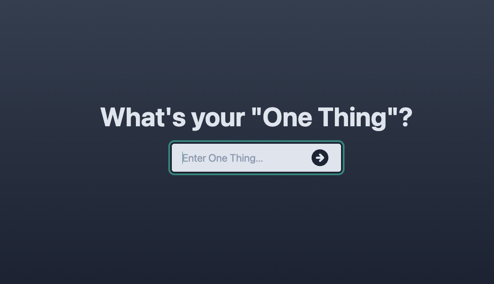

<div id="top"></div>
<!--
*** Thanks for checking out the Best-README-Template. If you have a suggestion
*** that would make this better, please fork the repo and create a pull request
*** or simply open an issue with the tag "enhancement".
*** Don't forget to give the project a star!
*** Thanks again! Now go create something AMAZING! :D
-->

<!-- PROJECT SHIELDS -->
<!--
*** I'm using markdown "reference style" links for readability.
*** Reference links are enclosed in brackets [ ] instead of parentheses ( ).
*** See the bottom of this document for the declaration of the reference variables
*** for contributors-url, forks-url, etc. This is an optional, concise syntax you may use.
*** https://www.markdownguide.org/basic-syntax/#reference-style-links
-->
[![Contributors][contributors-shield]][contributors-url]
[![Forks][forks-shield]][forks-url]
[![Stargazers][stars-shield]][stars-url]
[![Issues][issues-shield]][issues-url]
[![MIT License][license-shield]][license-url]
[![LinkedIn][linkedin-shield]][linkedin-url]

<!-- PROJECT LOGO -->
<br />
<div align="center">
  <a href="https://github.com/drobb2020/one-thing">
    
  </a>

  <h3 align="center">One Thing React Beginners Project</h3>

  <p align="center">
    A cool React application for beginners. Hosted by Coding-in-Public on YouTube.
    <br />
    <a href="https://github.com/drobb2020/one-thing"><strong>Explore the docs »</strong></a>
    <br />
    <br />
    <a href="https://github.com/drobb2020/one-thing">View Demo</a>
    ·
    <a href="https://github.com/drobb2020/one-thing/issues">Report Bug</a>
    ·
    <a href="https://github.com/drobb2020/one-thing/issues">Request Feature</a>
  </p>
</div>

<!-- TABLE OF CONTENTS -->
<details>
  <summary>Table of Contents</summary>
  <ol>
    <li>
      <a href="#about-the-project">About The Project</a>
      <ul>
        <li><a href="#built-with">Built With</a></li>
      </ul>
    </li>
    <li>
      <a href="#getting-started">Getting Started</a>
      <ul>
        <li><a href="#prerequisites">Prerequisites</a></li>
        <li><a href="#installation">Installation</a></li>
      </ul>
    </li>
    <li><a href="#usage">Usage</a></li>
    <li><a href="#roadmap">Roadmap</a></li>
    <li><a href="#contributing">Contributing</a></li>
    <li><a href="#license">License</a></li>
    <li><a href="#contact">Contact</a></li>
    <li><a href="#acknowledgments">Acknowledgments</a></li>
  </ol>
</details>

<!-- ABOUT THE PROJECT -->
## About The Project



This is a simple react single page application geared towards beginners learning react. The app did not take long to complete and there are some fundamental lessons to learn in this project.

Have fun if you decide to clone the repo.

<p align="right">(<a href="#top">back to top</a>)</p>

### Built With

frameworks/libraries used to create the project.

* [React.js](https://reactjs.org/)
* [Vite](https://vitejs.dev/guide/)
* [Tailwindcss](https://tailwindcss.com/docs/installation/using-postcss)

<p align="right">(<a href="#top">back to top</a>)</p>

<!-- GETTING STARTED -->
## Getting Started

You can clone my repo or build this yourself from scratch. If you clone the repo, you only need to do steps #1, and #3 to get the app working.

### Prerequisites

This project was started using pnpm. If you don't have this package installed you can use the command below to install it. Otherwise you can use npm.

* Install [pnpm](https://pnpm.io/installation)

  ```sh
  curl -fsSL https://get.pnpm.io/install.sh | sh -
  ```

### Installation

1. Clone the repo

   ```sh
   git clone https://github.com/seobb2020/one-thing.git
   ```

2. Or, create the project from scratch

   ```sh
   pnpm create vite one-ting --template react
   ```

3. Install NPM packages

   ```sh
   pnpm install
   ```

4. Run the application

   ```sh
   pnpm run dev
   ```

5. Additional packages to install

   ```sh
   pnpm install -D tailwindcss postcss autoprefixer
   npx tailwindcss init -p # Configures Tailwindcss & postcss
   pnpm install @heroicons/react
   pnpm install js-confetti
   ```

6. Configure the tailwindcss.config.cjs file by adding the following:

   ```sh
   content: ["./index.html", "./src/**/*.{js,ts,jsx,tsx}"],
   ```

<p align="right">(<a href="#top">back to top</a>)</p>

<!-- USAGE EXAMPLES -->
## Usage

This is a simple demo application for first-time react developers. I did not take this project live. It does not have any backend storage and can handle only one task at a time (hence one thing).

<p align="right">(<a href="#top">back to top</a>)</p>

<!-- ROADMAP -->
## Roadmap

See the [open issues](https://github.com/drobb2020/one-thing/issues) for a full list of proposed features (and known issues).

<p align="right">(<a href="#top">back to top</a>)</p>

<!-- CONTRIBUTING -->
## Contributing

Contributions are what make the open source community such an amazing place to learn, inspire, and create. Any contributions you make are **greatly appreciated**.

If you have a suggestion that would make this better, please fork the repo and create a pull request. You can also simply open an issue with the tag "enhancement".
Don't forget to give the project a star! Thanks again!

1. Fork the Project
2. Create your Feature Branch (`git checkout -b feature/AmazingFeature`)
3. Commit your Changes (`git commit -m 'Add some AmazingFeature'`)
4. Push to the Branch (`git push origin feature/AmazingFeature`)
5. Open a Pull Request

<p align="right">(<a href="#top">back to top</a>)</p>

<!-- LICENSE -->
## License

Distributed under the MIT License. See `LICENSE.txt` for more information.

<p align="right">(<a href="#top">back to top</a>)</p>

<!-- CONTACT -->
## Contact

Your Name - [@davidrobb2](https://twitter.com/davidrobb2) - drobb2011@gmail.com

Project Link: [https://github.com/drobb2020/one-thing](https://github.com/drobb2020/one-thing)

<p align="right">(<a href="#top">back to top</a>)</p>

<!-- ACKNOWLEDGMENTS -->
## Acknowledgments

Use this space to list resources you find helpful and would like to give credit to. I've included a few of my favorites to kick things off!

Thanks goes to [Chris Pennington](https://www.youtube.com/c/CodinginPublic) (Coding in Public) for presenting this project on [YouTube](https://www.youtube.com/watch?v=s84yXvLOoio&t=1s). Please subscribe to his channel!

#### Other resources

* [Choose an Open Source License](https://choosealicense.com)
* [GitHub Emoji Cheat Sheet](https://www.webpagefx.com/tools/emoji-cheat-sheet)
* [Malven's Flexbox Cheatsheet](https://flexbox.malven.co/)
* [Malven's Grid Cheatsheet](https://grid.malven.co/)
* [Img Shields](https://shields.io)
* [Vite](https://vitejs.dev/)
* [pnpm](https://pnpm.io/)
* [React HeroIcons](https://heroicons.com/)

<p align="right">(<a href="#top">back to top</a>)</p>

<!-- MARKDOWN LINKS & IMAGES -->
<!-- https://www.markdownguide.org/basic-syntax/#reference-style-links -->
[contributors-shield]: https://img.shields.io/github/contributors/drobb2020/one-thing.svg?style=for-the-badge
[contributors-url]: https://github.com/drobb2020/one-thing/graphs/contributors
[forks-shield]: https://img.shields.io/github/forks/drobb2020/one-thing.svg?style=for-the-badge
[forks-url]: https://github.com/drobb2020/one-thing/network/members
[stars-shield]: https://img.shields.io/github/stars/drobb2020/one-thing.svg?style=for-the-badge
[stars-url]: https://github.com/drobb2020/one-thing/stargazers
[issues-shield]: https://img.shields.io/github/issues/drobb2020/one-thing.svg?style=for-the-badge
[issues-url]: https://github.com/drobb2020/one-thing/issues
[license-shield]: https://img.shields.io/github/license/drobb2020/one-thing.svg?style=for-the-badge
[license-url]: https://github.com/drobb2020/one-thing/blob/master/LICENSE.txt
[linkedin-shield]: https://img.shields.io/badge/-LinkedIn-black.svg?style=for-the-badge&logo=linkedin&colorB=555
[linkedin-url]: https://www.linkedin.com/in/david-robb-42436a20/
[product-screenshot]: public/screenshot.png
